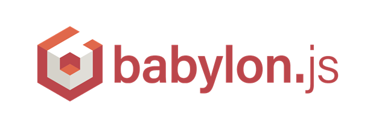

# WebGL & Babylon.JS 4 - Videogame: First Personnal Shooter

*February 2020*

> 🔨 Videogame using WebGL and Babylon.js 4. Babylon.js is a real time 3D engine using a JavaScript library for displaying 3D graphics in a web browser via HTML5. You could find the OpenClassRooms lesson followed [here](https://openclassrooms.com/fr/courses/3979376-creez-votre-propre-fps-en-webgl).

`node server.js`

## Ressources

- [Tutorial (fr): Créez votre propre FPS en WebGL](https://openclassrooms.com/fr/courses/3979376-creez-votre-propre-fps-en-webgl)
- [Github: Learn to create your own FPS in WebGl (en)](https://github.com/oc-courses/initiation-babylon)
- [Github: An implementation of Express and BabylonJS to make it easier to code BabylonJS apps in NodeJS (en)](https://github.com/yazheirx/babylon_express_server)
- [Le modèle objet JavaScript en détails (fr)](https://developer.mozilla.org/fr/docs/Web/JavaScript/Guide/Le_mod%C3%A8le_objet_JavaScript_en_d%C3%A9tails)
- [Constructeur Object, prototype et héritage en JavaScript (fr)](https://www.pierre-giraud.com/javascript-apprendre-coder-cours/constructeur-object-prototype-heritage/)
- [Chrome mousedown and mouseup events no longer working, other browsers are fine](https://stackoverflow.com/questions/41181372/chrome-mousedown-and-mouseup-events-no-longer-working-other-browsers-are-fine/41238807#41238807)
- [Deploy Simple Node JS App on Heroku in Minutes](https://www.positronx.io/deploy-simple-node-js-app-on-heroku-in-minutes/)