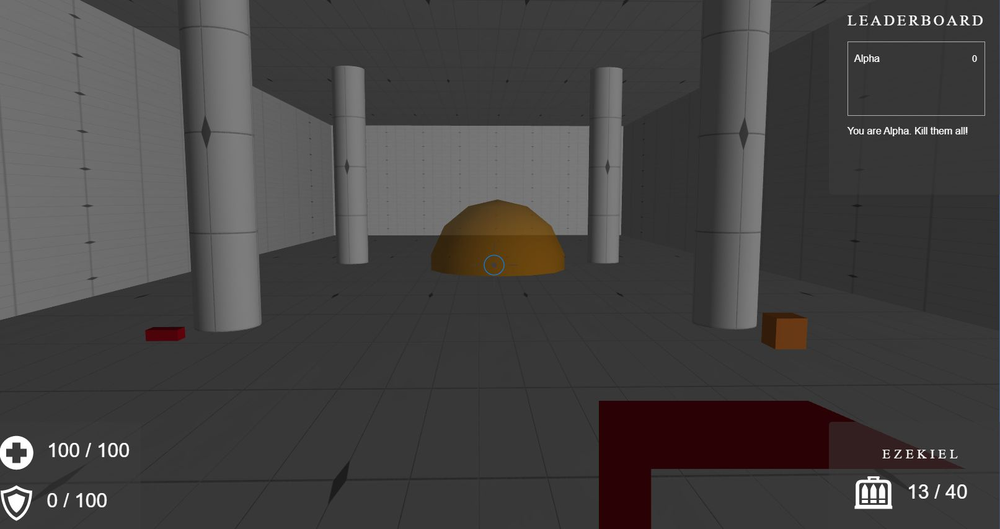

# WebGL: Babylon.JS & SocketIO- Videogame: Online Multiplayer First Personnal Shooter

*April 2020*

> 🔨 Multiplayer videogame using WebGL with **Babylon.js v4**. Babylon.js is a real time 3D engine using a **JavaScript library** for displaying 3D graphics in a web browser via **HTML5**. Multiplayer is managed with **WebSockets (SocketIO)**. You could find the OpenClassRooms lesson followed [here](https://openclassrooms.com/fr/courses/3979376-creez-votre-propre-fps-en-webgl). Demo on [Heroku](https://babylon-fps-online.herokuapp.com/).

## About

Several components are used in this game.

**Arena.js**:

**Game.js**:

**Ghostplayer.js**:

**NetworkManager.js**:

**Player.js**:

**Weapon.js**:

## How to use

**Warning**: WebGL / material acceleration has to be enabled in your browser. The use of Babylon / WebGL needs a strong GPU (quite decent NVidia or AMD Graphic card) to work fluidly. It won't work without it, even with a powerfull CPU. 

How to enable WebGL in your browser?

- [Chrome](https://www.quora.com/How-do-I-enable-WebGL-2-0-in-Chrome)
- [Firefox](https://www.interplaylearning.com/help/how-to-enable-webgl-in-firefox)
- [Explorer 11 / Edge](https://support.microsoft.com/en-us/help/2528233/how-to-enable-or-disable-software-rendering-in-internet-explorer)
- [Safari](https://www.wikihow.com/Enable-Webgl#Using-Safari)

### Local

- Clone
- Update node_modules: `npm install`
- Run: `node server.js`
- Open the app using [http://localhost:8000/](http://localhost:8000/)

### Online

See the demo on [Heroku](https://babylon-fps-online.herokuapp.com/).

Of course you will have to find one or several partners to play the game. Each player has to open the URL to reach the game room.

## Ressources

- [Tutorial (fr): Créez votre propre FPS en WebGL](https://openclassrooms.com/fr/courses/3979376-creez-votre-propre-fps-en-webgl)
- [Github: Learn to create your own FPS in WebGl (en)](https://github.com/oc-courses/initiation-babylon)
- [Github: An implementation of Express and BabylonJS to make it easier to code BabylonJS apps in NodeJS (en)](https://github.com/yazheirx/babylon_express_server)
- [Le modèle objet JavaScript en détails (fr)](https://developer.mozilla.org/fr/docs/Web/JavaScript/Guide/Le_mod%C3%A8le_objet_JavaScript_en_d%C3%A9tails)
- [Constructeur Object, prototype et héritage en JavaScript (fr)](https://www.pierre-giraud.com/javascript-apprendre-coder-cours/constructeur-object-prototype-heritage/)
- [Chrome mousedown and mouseup events no longer working, other browsers are fine](https://stackoverflow.com/questions/41181372/chrome-mousedown-and-mouseup-events-no-longer-working-other-browsers-are-fine/41238807#41238807)
- [Deploy Simple Node JS App on Heroku in Minutes](https://www.positronx.io/deploy-simple-node-js-app-on-heroku-in-minutes/)
- [Causes of Heroku H10-App Crashed Error And How To Solve Them](https://dev.to/lawrenceagles/causes-of-heroku-h10-app-crashed-error-and-how-to-solve-them-3jnl)